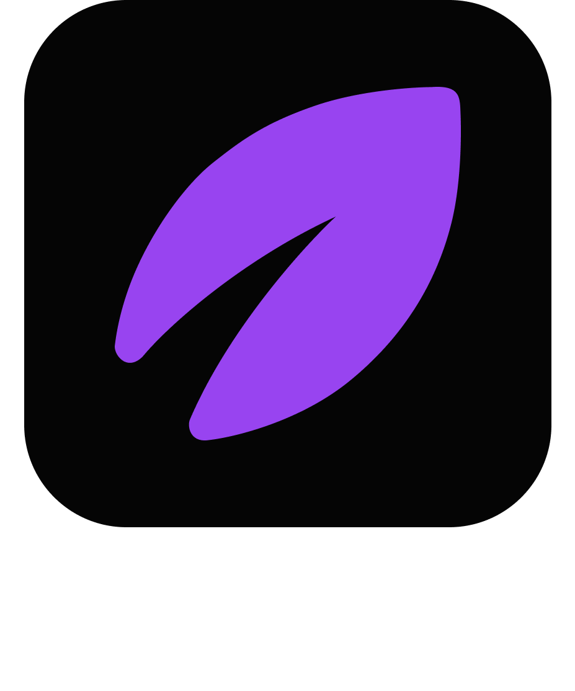
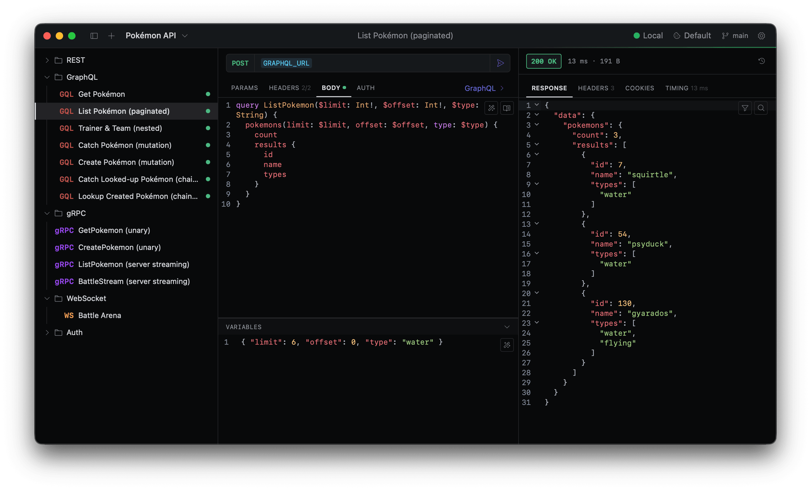

  

<h4 align="center">⭐ Star the repo to show your support 🙏</h4>

  <h1 align="center">AI-friendly API client</h1>

One native, <strong>AI-friendly</strong> client for HTTP, gRPC, WebSocket, and GraphQL.
The local-first client for the AI era.

**One client. Every protocol.** Voleeo is a free, open-source, local-first API client for
HTTP, gRPC, WebSocket, and GraphQL — built for the AI era.

> [!WARNING]
> **Voleeo is in early access (EA).** 
> Expect rough edges and the occasional bug while we move fast.
> Don't rely on it for production work yet — and if something breaks, [open an issue](https://github.com/voleeo/voleeo-app/issues). 
> Your feedback shapes what ships next.

## Features

Voleeo runs natively on your machine — no browser CORS limits, no payload caps, no 30-second timeouts. 
Zero telemetry, no account, no cloud lock-in: your workspaces and secrets live on disk and stay there.

- 🐛 [Report a bug](https://github.com/voleeo/voleeo-app/issues/new?template=bug_report.md)
- 💡 [Request a feature](https://github.com/voleeo/voleeo-app/issues/new?template=feature_request.md)

### ⚡ Every protocol, one window

- Send requests over HTTP/HTTPS, gRPC, WebSocket, and GraphQL — one app, one UI.
- Import collections/workspaces from OpenAPI, Swagger, Postman, Insomnia, Bruno or Yaak.
- Inspect each request with a phase-by-phase timeline (DNS, redirects, chunks, errors) and in-flight cancellation.
- Stream and window 20 MB+ responses, filter with JSONPath, fold, and search them server-side.

### 🤖 Built for AI agents

- Voleeo is an [MCP](https://modelcontextprotocol.io) server — point any MCP client at it and your agent shares the workspace you see on screen.
- Agents read, create, and edit requests, run calls, and manage environments without leaving the chat.

### 🔐 Stay secure

- Authenticate with OAuth 2.0, Bearer, Basic, AWS SigV4, Digest, or NTLM.
- Encrypt sensitive values per workspace with AES-256-GCM.
- Store keys in your OS keychain, outside the synced workspace.

### 🔀 Organize & collaborate

- Group requests into workspaces and nested folders.
- Switch between dev, staging, and prod with global, personal, and folder-scoped variables.
- Version collections in Git — commit, push/pull, branch, and resolve conflicts, with per-file history and revert.

### 🛠️ Extend & customize

- Insert dynamic values like `{{ uuid.v4() }}` or timestamps with template functions, rendered as chips.
- Chain values from earlier responses into the next request.
- Pick from built-in base16 themes or build your own.
- Write plugins that add themes, template functions, and request actions.

## Contributing

Contributions are welcome — see [CONTRIBUTING.md](CONTRIBUTING.md) for dev setup, the quality gates,
and the architecture rules in [AGENTS.md](AGENTS.md). To report a security issue, see
[SECURITY.md](SECURITY.md).

## License

[MIT](LICENSE) © Voleeo
